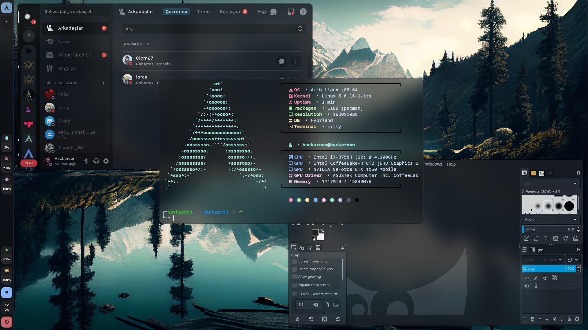
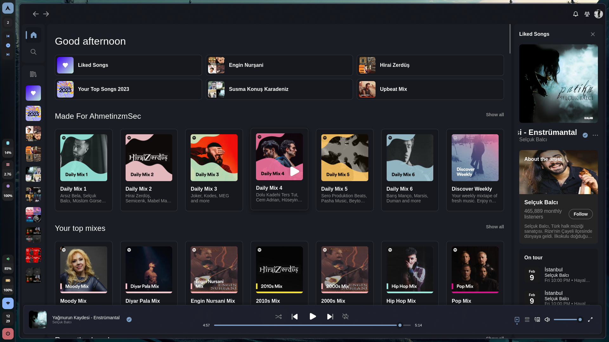

# Dotfiles Install

```
git clone https://github.com/AhmetinzmSec/Hyprland-DotFiles-v2.5.git
```

```cd Hyprland-DotFiles-v2.5```

Run the install file (Beta): `./Install.sh`

or install it manually:


Let's start with a backup. To receive using a terminal:

```
cp -r ~/.config ~/.config.bak
cp -r ~/.icons ~/.icons.bak
cp -r ~/.fonts ~/.fonts.bak
cp -r ~/.themes ~/.themes.bak
cp -r ~/.zshrc ~/.zshrc.bak
cp -r ~/.aliases ~/.aliases.bak
```

Or take a manual backup:


- Don't lose your configuration:

Go to the `/home/user/` directory and copy the `.config` folder and paste it without leaving the same directory. Change the name of the pasted folder to `.config.bak`


- Don't lose your icons:

Go to the `/home/user/` directory and copy the `.icons` folder and paste it without leaving the same directory. Change the name of the pasted folder to `.icons.bak`


- Don't lose your fonts:

Go to the `/home/user/` directory and copy the `.fonts` folder and paste it without leaving the same directory. Change the name of the pasted folder to `.fonts.bak`


- Don't lose your themes:

Go to the `/home/user/` directory and copy the `.themes` folder and paste it without leaving the same directory. Change the name of the pasted folder to `.themes.bak`


Now let's back up our files:


- Don't lose your ZSH configuration:

Go to the `/home/user/` directory and copy and paste the `.zshrc` file without leaving the same directory. Change the name of the pasted file to `.zshrc.bak`


- Aliases are a file specially prepared for me. Most likely you do not have this file. If so, follow this step:

Go to the `/home/user/` directory and copy and paste the `.aliases` file without leaving the same directory. Change the name of the pasted file to `.aliases.bak`


Pay attention to the file and folder names I wrote. If the name of your configuration files is not currently written, you do not have any previous configuration. You don't need to make backups for these.

For example, I have a file named `.aliases`. This file does not have to be available to everyone. You don't need to force a backup for this.


# Required Softwares

Let's install our software:

```
[Arch Linux]
yay -S nm-connection-editor nwg-drawer cava mpd mpv vlc sway tmux hyprland waybar grimblast sddm brightnessctl playerctl swaylock-effects pamixer rofi rofi-emoji rofi-power-menu wf-recorder btop zsh oh-my-zsh-powerline-theme-git ark unrar zip unzip pavucontrol xdg-desktop-portal-wlr neovim vim nano git wget swaybg dunst dolphin kvantum kate appimagelauncher-bin noto-fonts-emoji wl-clipboard xfce4-appfinder wofi catfish firefox kitty polkit-gnome gnome-keyring ntfs-3g cliphist qt5ct qt5 plasma lxappearance tesseract-data-tur tesseract-data-eng tesseract-data-rus visual-studio-code-bin spicetify-cli jdk-openjdk discord bitwarden flatpak gimp kitty kdenlive inkscape konsole neofetch github-desktop-bin webapp-manager steam virt-manager qemu-desktop dnsmasq iptables-nft go yarn npm nodejs python-pip hyprpicker syncthing spotify obsidian qbittorrent obs-studio lutris portmaster-stub-bin paru-bin
```

# Optional Softwares

```
[All Distros]
flatpak install stremio flatseal obsproject atom
```

# Change Flatpak Apps Theme

```
sudo flatpak override --filesystem=$HOME/.themes
sudo flatpak override --filesystem=$HOME/.icons
sudo flatpak override --env=GTK_THEME=Andromeda-GTK
sudo flatpak override --env=ICON_THEME=Nordzy-dark
```

# Change System Theme

- This process is required to activate qt5ct in the system and to apply the GTK Theme. We can start editing the environment side by typing the command `sudo nano /etc/environment`

```
...
GTK_THEME=Andromeda-GTK
QT_QPA_PLATFORMTHEME=qt5ct
...
```

- Let's Change SDDM Theme

I am sharing the real repo of SDDM Theme with you. Please download from the official repo to respect the effort:

```
git clone https://github.com/keyitdev/sddm-astronaut-theme.git

sudo cp -r sddm-astronaut-theme/ /usr/share/themes/

echo "[Theme]
Current=sddm-astronaut-theme
CursorTheme=Adwaita" | sudo tee /etc/sddm.conf

```

- Change GRUB Theme

```
sudo cp -r GRUB Theme/cyber/* /usr/share/grub/themes

sudo nano /etc/default/grub
```

Add Line
```
GRUB_THEME="/usr/share/grub/themes/theme.txt"
```

Save and exit and run command:

```
sudo grub-mkconfig -o /boot/grub/grub.cfg
```

# Change Shell

```
sudo chsh -s $(which zsh)
chsh -s $(which zsh)
```


# Spicetify Config

- Authorization Settings

```
sudo chmod a+wr /opt/spotify

sudo chmod a+wr /opt/spotify/Apps -R
```

- Backup Apply Enable Devtools

```
spicetify backup apply enable-devtools
```

- Apply Theme

```
 spicetify config current_theme Bloom color_scheme dark
 spicetify config inject_css 1 replace_colors 1 overwrite_assets 1 inject_theme_js 1
 spicetify apply
```

# Screenshot Desktop



# Screenshot Spotify


